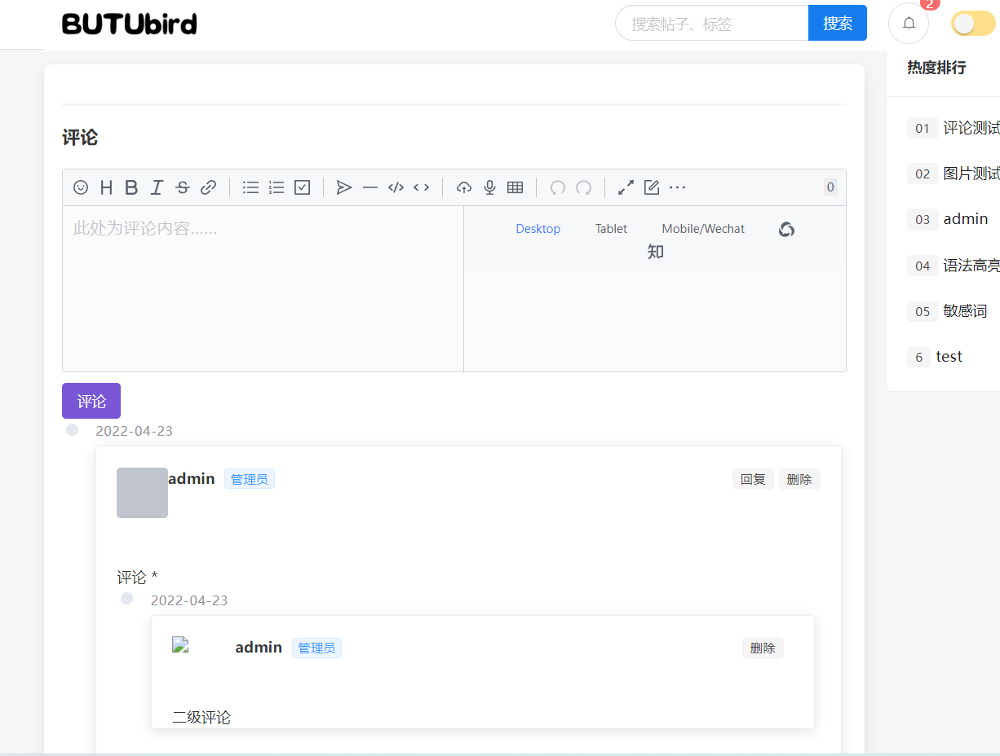

<div align="center">

## BTForum

*** 


一个**前后端分离的论坛系统**。[**前端**](https://github.com/BUTUbird/forum-vue)使用**Vue**+ **ElementUi**框架，**后端**使用**SpringBoot**框架。

</div>

*** 
## 注意事项
***
>本项目使用七牛云存储用户头像等图片资源。第一次部署项目时，需要配置七牛云存储，并将七牛云存储的秘钥和域名添加到配置文件中。

  ```yaml
  #七牛云配置，测试域名有效期为一个月，请尽快更新为自己的域名。
   oss:
   domain: http://****.hn-bkt.clouddn.com/     # 访问域名(默认使用七牛云测试域名)
   accessKey:  # 公钥
   secretKey:  # 私钥
   bucket:   #存储空间名称
  ```
>本项目使用Mariadb作为数据库，可以根据需要替换**bt-framework**中**pom.xml**文件中数据库连接方式。
## 项目中初始用户和密码
***
>普通用户：user 密码：123456
>管理员：admin 密码：123456

## 模块划分
***


| 模块名称 | 模块描述 |
|:---------|:---------|
|Billboard | 公告 |
|Carousel | 轮播 |
|Comment | 评论 |
|Echart | 图表 |
|Post | 帖子 |
|Promotion | 广告 |
|Relation | 关系 |
|Search | 搜索 |
|Tag | 标签 |
|Tip | 一言 |
|Upload | 上传 |
|User | 用户 |
|WebSocket | WebSocket & 消息提醒 |
|Word |敏感词|


## 系统架构
***


## 数据库结构
***
>ER图是IDEA自动生成的，将就看吧。


## 后端技术
***
|       技术       |           说明           |                                           官网                                            |
|:--------------:|:----------------------:|:---------------------------------------------------------------------------------------:|
|   SpringBoot   |         MVC框架          |    [ https://spring.io/projects/spring-boot](https://spring.io/projects/spring-boot)    |
| SpringSecurity |        认证和授权框架         |                       https://spring.io/projects/spring-security                        |
|  MyBatis-Plus  |         ORM框架          |                                https://mp.baomidou.com/                                 |
|   Swagger-UI   |         文档生产工具         | [ https://github.com/swagger-api/swagger-ui](https://github.com/swagger-api/swagger-ui) |
|     Redis      |         分布式缓存          |                                    https://redis.io/                                    |
|      七牛云       |       七牛云 - 对象储存       |                      https://developer.qiniu.com/sdk#official-sdk                       |
|      JWT       |        JWT登录支持         |                              https://github.com/jwtk/jjwt                               |
|     SLF4J      |          日志框架          |                                  http://www.slf4j.org/                                  |
|     Lombok     |        简化对象封装工具        |    [ https://github.com/rzwitserloot/lombok](https://github.com/rzwitserloot/lombok)    |
|    kaptcha     |         验证码框架          |              https://mvnrepository.com/artifact/com.github.penggle/kaptcha              |
 |  knife4j       |   Knife4j框架            |                    https://github.com/xiaoymin/swagger-bootstrap-ui                     |                                  

## 赞赏
***
>如果您觉得本项目对您有帮助，可以请我喝一杯奶茶噢。


| 支付宝                                                        | 微信                                                        |
|:-----------------------------------------------------------|:----------------------------------------------------------|
|  |  |

##   环境搭建
### 开发环境

| 工具         |   版本号   |      下载       |
|:----------:|:-------:| :----------------------------------------------------------: |
| JDK |   11    |https://d6.injdk.cn/openjdk/amazon/11/amazon-corretto-11.0.10.9.1-windows-x64-jdk.zip|
| Maven |  3.8.4  | http://maven.apache.org/ |
 |MariaDB | 10.7.3  | https://mariadb.org/ |
 |Redis | 3.0.504 | https://redis.io/|

## 运行截图

>七牛云域名过期了，图片没显示，懒得换了，将就着看吧。
***
| 网站前台 | 网站后台 |
|:----------|:----------|
|| |
| | |
| ||
| ||
|||
|||
## 致谢
***


本项目大量借鉴了[极光社区](https://github.com/1ongclaw/letao)与[豆宝社区](https://github.com/songboriceman/doubao_community_backend),在此感谢原作者的无私开源。
